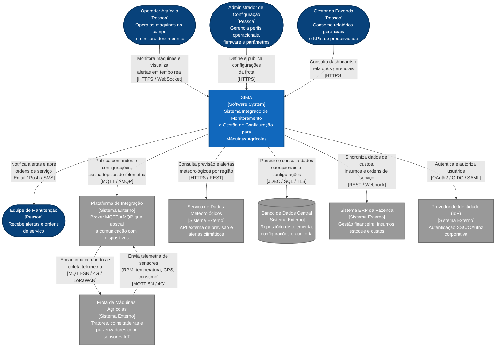

# C4 Model Software Architecture

Este repositório documenta a arquitetura do **SIMA — Sistema Integrado de Monitoramento e Gestão de Configuração para Máquinas Agrícolas**, usando o **C4 Model** para representar o sistema em relação aos seus usuários, integrações externas e responsabilidades principais.

## Visão Geral

O SIMA é uma plataforma corporativa voltada ao monitoramento e à gestão de configuração de frotas agrícolas conectadas. O sistema centraliza dados de telemetria, dashboards operacionais, alertas, configurações remotas, atualizações de firmware e integrações com serviços externos, como clima, ERP, banco de dados central e provedor de identidade.

## Objetivos do Projeto

- Representar o **diagrama de contexto** do SIMA no C4 Model.
- Identificar atores humanos, sistemas externos e fronteiras de responsabilidade.
- Documentar os principais fluxos de comunicação entre o SIMA e seu ecossistema.
- Manter os diagramas como código, facilitando versionamento e evolução.

## Documentação

- [`docs.md`](docs.md): documentação completa do contexto, atores, sistemas externos, fronteiras e relacionamentos.
- [`diagrams/sima-context.mmd`](diagrams/sima-context.mmd): diagrama de contexto em Mermaid.

## Diagrama de Contexto



## Estrutura

```text
.
├── README.md
├── docs.md
└── diagrams/
    └── sima-context.mmd
```

## Como Visualizar

O diagrama Mermaid pode ser visualizado diretamente em plataformas com suporte a Mermaid, como GitHub, GitLab e editores compatíveis. Para uma explicação completa dos atores, sistemas externos e relacionamentos, consulte [`docs.md`](docs.md).