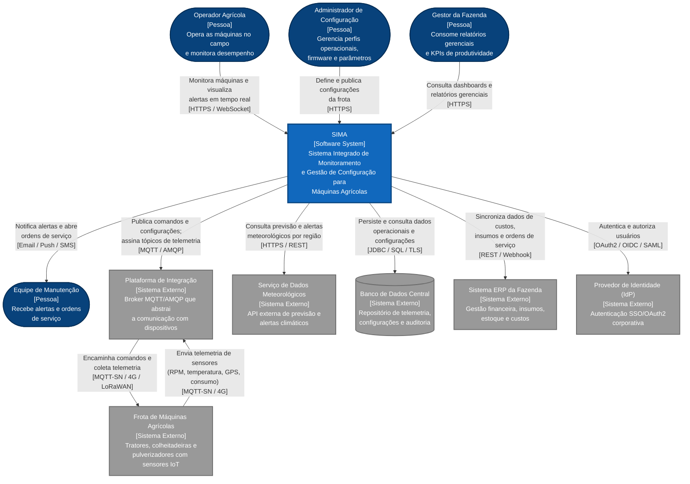

# Sistema Integrado de Monitoramento e Gestão de Configuração para Máquinas Agrícolas (SIMA)

## Diagrama de Contexto — C4 Model (Nível 1)

---

## Contexto do Projeto

A agricultura moderna passa por uma transformação digital acelerada. Frotas de máquinas agrícolas — tratores, colheitadeiras, pulverizadores e plantadeiras — estão cada vez mais equipadas com sensores IoT, GPS de alta precisão e sistemas de automação embarcados. Esses dispositivos geram um volume massivo de dados operacionais que, quando bem aproveitados, permitem decisões mais inteligentes, redução de custos e ganho de produtividade no campo.

O **SIMA — Sistema Integrado de Monitoramento e Gestão de Configuração para Máquinas Agrícolas** é a plataforma corporativa proposta para ser o "cérebro" dessa operação. O sistema tem três grandes responsabilidades:

- **Monitorar em tempo real** o desempenho e a saúde de cada máquina da frota, disponibilizando dashboards acessíveis via web e mobile.
- **Gerenciar configurações** dos dispositivos e sistemas embarcados, permitindo ajustes finos de operação, atualizações de firmware e versionamento.
- **Integrar dados externos** (especialmente meteorológicos) para apoiar a manutenção preventiva e o planejamento das operações no campo.

Este documento apresenta o **Nível 1 do C4 Model — Diagrama de Contexto**, que oferece uma visão de alto nível ("zoom out") do sistema em relação ao seu ecossistema. O objetivo é deixar claro **quem usa o sistema**, **com quais sistemas externos ele se integra** e **quais são as fronteiras de responsabilidade** entre o SIMA e o mundo ao seu redor.

A seguir são apresentados os três passos do desenvolvimento do diagrama de contexto:

1. Identificação dos atores e sistemas externos
2. Definição das fronteiras do sistema
3. Desenho do diagrama de contexto (como código)

---

## 1. Identificação dos Atores e Sistemas Externos

O primeiro passo foi mapear quem interage com o SIMA. Seguindo a notação do C4 Model, os elementos foram divididos em **pessoas (atores humanos)** e **sistemas externos**.

### 1.1 Pessoas (Atores Humanos)

| Ator | Papel | Necessidades principais |
|------|-------|------------------------|
| **Operador Agrícola** | Profissional que opera as máquinas no campo | Dashboards em tempo real, alertas críticos, interface mobile, suporte a baixa conectividade |
| **Administrador de Configuração** | Técnico ou agrônomo responsável pelos perfis operacionais | Editor de configurações, controle de versionamento, rollout e rollback de parâmetros e firmware |
| **Gestor da Fazenda** | Tomador de decisão estratégico/financeiro | Relatórios gerenciais, KPIs de produtividade e custos operacionais |
| **Equipe de Manutenção** | Responsável pelas intervenções técnicas nas máquinas | Recebimento de alertas e abertura automática de ordens de serviço |

### 1.2 Sistemas Externos

| Sistema | Função | Protocolo de Comunicação |
|---------|--------|--------------------------|
| **Frota de Máquinas Agrícolas (IoT)** | Origem da telemetria e destino dos comandos. Compreende tratores, colheitadeiras, pulverizadores e plantadeiras com sensores embarcados | MQTT-SN, 4G, LoRaWAN, Satélite |
| **Plataforma de Integração / Middleware IoT** | Broker de mensagens que abstrai a comunicação bidirecional com os dispositivos no campo | MQTT / AMQP |
| **Serviço de Dados Meteorológicos** | API externa que fornece previsão do tempo, alertas climáticos e dados históricos por região | HTTPS / REST |
| **Banco de Dados Central** | Repositório corporativo para persistência de telemetria, configurações, usuários e logs de auditoria | JDBC / SQL sobre TLS |
| **Sistema ERP da Fazenda** | Gestão financeira, controle de insumos, estoque e custos operacionais | REST / Webhook |
| **Provedor de Identidade (IdP)** | Serviço corporativo de autenticação SSO (Keycloak, Azure AD, Auth0) | OAuth2 / OIDC / SAML |

---

## 2. Definição das Fronteiras do Sistema

O segundo passo foi delimitar com precisão **o que está dentro do escopo do SIMA** e **o que é responsabilidade de sistemas externos**. Essa definição é fundamental para evitar acoplamento excessivo, deixar claras as responsabilidades de cada equipe e facilitar a manutenção e evolução do sistema.

### 2.1 Dentro do escopo do SIMA (responsabilidades próprias)

- Ingestão e processamento de telemetria das máquinas (em tempo real e em batch)
- Dashboards web e mobile para os operadores e gestores
- Motor de regras para disparo de alertas baseados em thresholds (ex.: temperatura, pressão, consumo)
- Gestão do ciclo de vida das configurações: criação, versionamento, rollout, rollback e auditoria
- Orquestração de comandos para a frota, incluindo atualização de firmware OTA (Over-the-Air)
- Correlação de dados climáticos com a performance operacional das máquinas
- Geração de relatórios gerenciais e analytics
- Autenticação, autorização e auditoria interna (RBAC, logs de ação)

### 2.2 Fora do escopo do SIMA (delegado a sistemas externos)

- **Coleta bruta dos sinais dos sensores** — responsabilidade do firmware embarcado nas máquinas. O SIMA consome dados já normalizados.
- **Roteamento físico e protocolos de baixo nível** — responsabilidade da Plataforma de Integração (middleware MQTT/AMQP).
- **Modelagem meteorológica** — o SIMA consome a API de clima, mas não calcula previsão.
- **Persistência física, backup e replicação** — gerenciados pela equipe responsável pelo Banco de Dados Central.
- **Gestão financeira e contábil completa** — delegada ao ERP da fazenda.
- **Gestão da identidade dos usuários** (cadastro, recuperação de senha, MFA) — delegada ao Provedor de Identidade corporativo.

---

## 3. Diagrama de Contexto (como código)

O terceiro passo é a representação visual das interações entre o SIMA, os atores humanos e os sistemas externos, seguindo rigorosamente a **notação oficial do C4 Model** proposta por Simon Brown.

A seguir são apresentadas **duas versões equivalentes** do diagrama, em ferramentas diferentes de "diagrama como código". Ambas representam exatamente as mesmas relações:

- **PlantUML** com a biblioteca oficial `C4-PlantUML` — versão recomendada por aderir à notação canônica do C4.
- **Mermaid** — versão alternativa que renderiza nativamente em plataformas como GitHub, GitLab e Notion.

### 3.1 Versão em PlantUML

```plantuml
@startuml SIMA_C4_Contexto
!include https://raw.githubusercontent.com/plantuml-stdlib/C4-PlantUML/master/C4_Context.puml

title Diagrama de Contexto (C4 - Nível 1)\nSistema Integrado de Monitoramento e Gestão de Configuração para Máquinas Agrícolas

' === ATORES (Pessoas) ===
Person(operador, "Operador Agrícola", "Opera as máquinas no campo e monitora desempenho via web e mobile")
Person(adminConfig, "Administrador de Configuração", "Gerencia perfis operacionais, firmware e parâmetros das máquinas")
Person(gestor, "Gestor da Fazenda", "Consome relatórios gerenciais, KPIs e indicadores de produtividade")
Person(manutencao, "Equipe de Manutenção", "Recebe alertas e ordens de serviço preventivas e corretivas")

' === SISTEMA CENTRAL ===
System(sima, "SIMA - Sistema Integrado de Monitoramento Agrícola", "Plataforma central que monitora a frota, gerencia configurações, dispara alertas e correlaciona dados operacionais e climáticos")

' === SISTEMAS EXTERNOS ===
System_Ext(maquinas, "Frota de Máquinas Agrícolas (IoT)", "Tratores, colheitadeiras, pulverizadores e plantadeiras com sensores e conectividade")
System_Ext(middleware, "Plataforma de Integração / Middleware IoT", "Broker MQTT/AMQP que abstrai a comunicação bidirecional com os dispositivos IoT")
System_Ext(clima, "Serviço de Dados Meteorológicos", "API externa de previsão do tempo, alertas climáticos e dados históricos")
SystemDb_Ext(bancoCentral, "Banco de Dados Central", "Repositório corporativo de telemetria, configurações, usuários e logs de auditoria")
System_Ext(erp, "Sistema ERP da Fazenda", "Gestão financeira, insumos, estoque e custos operacionais")
System_Ext(idp, "Provedor de Identidade (IdP)", "Autenticação SSO/OAuth2 corporativa (Keycloak, Azure AD)")

' === RELACIONAMENTOS COM OS ATORES ===
Rel(operador, sima, "Monitora máquinas e visualiza alertas em tempo real", "HTTPS / WebSocket")
Rel(adminConfig, sima, "Define e publica configurações da frota", "HTTPS")
Rel(gestor, sima, "Consulta dashboards e relatórios gerenciais", "HTTPS")
Rel(sima, manutencao, "Notifica alertas e abre ordens de serviço", "Email / Push / SMS")

' === RELACIONAMENTOS COM SISTEMAS EXTERNOS ===
Rel(sima, middleware, "Publica comandos e configurações; assina tópicos de telemetria", "MQTT / AMQP")
Rel(middleware, maquinas, "Encaminha comandos e coleta telemetria dos dispositivos", "MQTT-SN / 4G / LoRaWAN")
Rel(maquinas, middleware, "Envia telemetria de sensores (RPM, temperatura, GPS, consumo)", "MQTT-SN / 4G")

Rel(sima, clima, "Consulta previsão e alertas meteorológicos por região", "HTTPS / REST")
Rel(sima, bancoCentral, "Persiste e consulta dados operacionais, históricos e configurações", "JDBC / SQL / TLS")
Rel(sima, erp, "Sincroniza dados de custos, insumos e ordens de serviço", "REST / Webhook")
Rel(sima, idp, "Autentica e autoriza usuários", "OAuth2 / OIDC / SAML")

SHOW_LEGEND()

@enduml
```

### 3.2 Versão em Mermaid (equivalente)

O código-fonte deste diagrama também está versionado em [`diagrams/sima-context.mmd`](diagrams/sima-context.mmd).



---

## 4. Descrição dos Relacionamentos

A tabela abaixo documenta cada interação representada no diagrama, garantindo clareza sobre os fluxos de informação entre os elementos.

### 4.1 Relacionamentos entre Atores e o Sistema

| Origem | Destino | Descrição da Interação | Protocolo |
|--------|---------|------------------------|-----------|
| Operador Agrícola | SIMA | Monitora máquinas e visualiza alertas em tempo real | HTTPS / WebSocket |
| Administrador de Configuração | SIMA | Define e publica configurações da frota | HTTPS |
| Gestor da Fazenda | SIMA | Consulta dashboards e relatórios gerenciais | HTTPS |
| SIMA | Equipe de Manutenção | Notifica alertas e abre ordens de serviço | Email / Push / SMS |

### 4.2 Relacionamentos entre o Sistema e Sistemas Externos

| Origem | Destino | Descrição da Interação | Protocolo |
|--------|---------|------------------------|-----------|
| SIMA | Middleware IoT | Publica comandos e configurações; assina tópicos de telemetria | MQTT / AMQP |
| Middleware IoT | Frota de Máquinas | Encaminha comandos e coleta telemetria dos dispositivos | MQTT-SN / 4G / LoRaWAN |
| Frota de Máquinas | Middleware IoT | Envia telemetria de sensores (RPM, temperatura, GPS, consumo) | MQTT-SN / 4G |
| SIMA | Serviço Meteorológico | Consulta previsão e alertas climáticos por região | HTTPS / REST |
| SIMA | Banco de Dados Central | Persiste e consulta dados operacionais, históricos e configurações | JDBC / SQL / TLS |
| SIMA | ERP da Fazenda | Sincroniza dados de custos, insumos e ordens de serviço | REST / Webhook |
| SIMA | Provedor de Identidade | Autentica e autoriza usuários | OAuth2 / OIDC / SAML |

---

## 5. Notação Utilizada (C4 Model)

O diagrama segue a notação visual padrão proposta por Simon Brown no C4 Model:

| Elemento Visual | Significado |
|-----------------|-------------|
| **Caixa azul-escuro com borda escura** (Pessoa) | Ator humano que interage com o sistema |
| **Caixa azul-claro destacada** (Software System) | Sistema central sendo modelado (SIMA) |
| **Caixa cinza** (External System) | Sistema externo que se integra ao sistema central |
| **Cilindro cinza** (External Database) | Banco de dados externo |
| **Setas com rótulo** | Fluxo de informação, com descrição da interação e protocolo entre colchetes |

---

